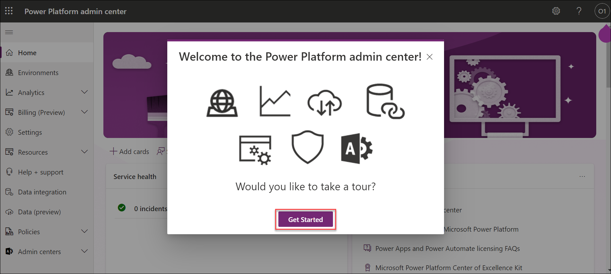
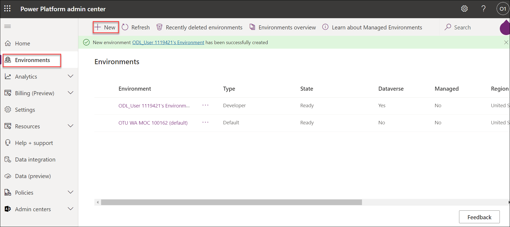
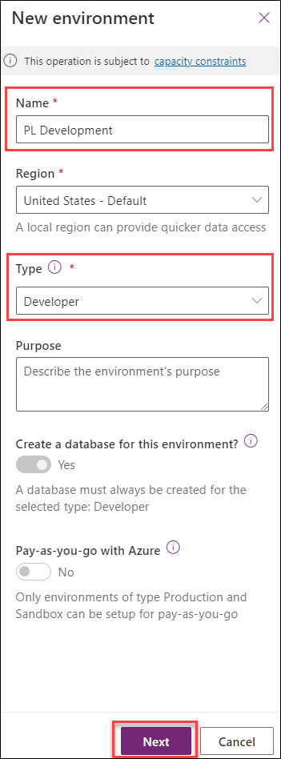
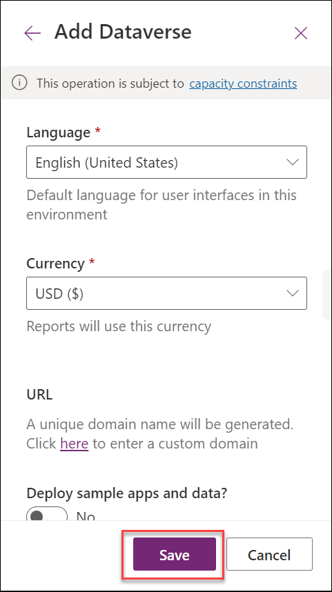
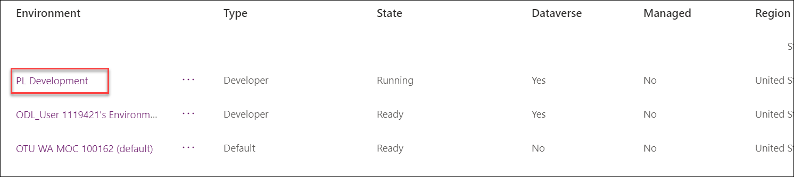
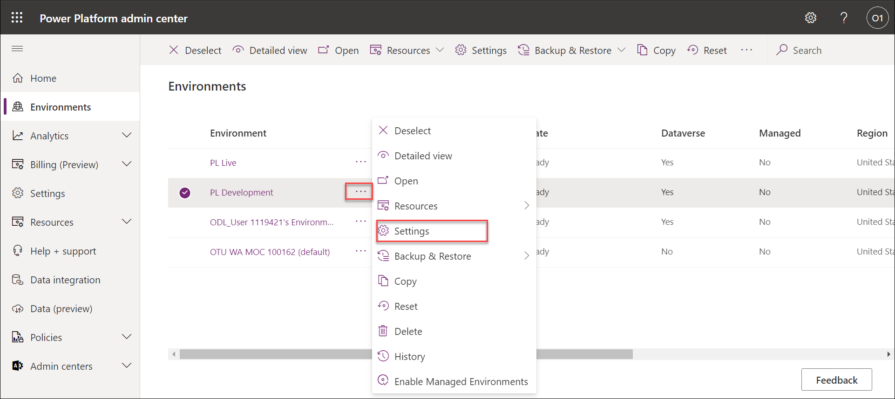
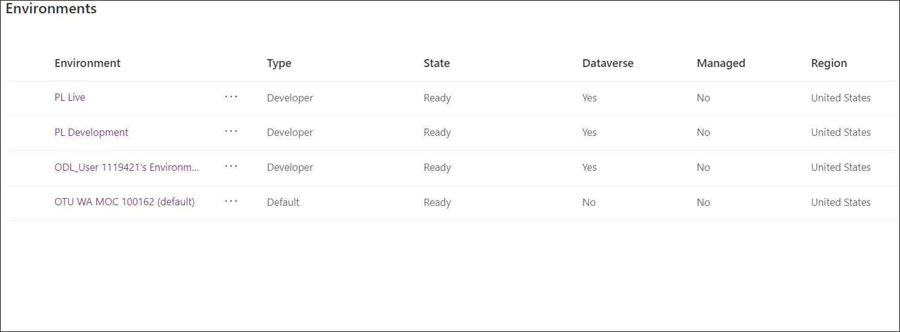

# Module 1 : Lab 1.1 - Create environments

## Scenario

In this lab, you create environments for use during the remainder of the labs.

## Lab objectives
In this lab, you will perform:

+ Task 1: Create development environment
+ Task 2: Create live environment

## Exercise 1 - Create environments

In this exercise, you will create a *Development* environment that you will do the majority of your lab work in and a *Live* environment to deploy solutions into.

**Note:** Depending on the browser that you are using, it is suggested that you disable any pop-up blockers that maybe enabled. This will allow pop-up windows to appear as they should.

### Task 1.1 – Create development environment

1.  Navigate to the Power Platform admin center `https://aka.ms/ppac` and sign in with your Microsoft 365 credentials if prompted again.

1.  Select **Get Started** or close the Welcome pop-up.
   
     

1.  Select **Environments** from the left navigation pane. There should be a single environment, OTU WA MOC 100162(default).

1.  Select **+ New**.

    

1.  In the **Name** text box, enter **[my initials] Development**. (Example: PL Development).

1.  In the **Type** drop down, select **Developer**.

1.  Leave all other selections as default and select **Next**.

    

1.  On the **Add Dataverse** tab, select **Save**.

   
    

1.  Your **Development** environment should now show in the list of environments.

    

1.  Your Development environment may take a few minutes to provision. Select **Refresh** if needed. When your environment **State** shows as **Ready**, select your **Development** environment by clicking on the ellipses (...) next to its name to expand the drop down menu and select **Settings**.

    

1.  Explore the different areas in **Settings** that you may be interested in but do not make any changes yet.
   
   > **Congratulations** on completing the task! Now, it's time to validate it. Here are the steps:
> - Click the (...) icon located at the upper right corner of the lab guide section and navigate to the Lab Validation Page.
> - Hit the Validate button for the corresponding task.If you receive a success message, you can proceed to the next task. 
> - If not, carefully read the error message and retry the step, following the instructions in the lab guide.
> - If you need any assistance, please contact us at labs-support@spektrasystems.com. We are available 24/7 to help you out.

### Task 1.2 – Create live environment

1.  Navigate to environments in the Power Platform admin center <https://admin.powerplatform.microsoft.com/environments>.

1.  Select **+ New**. 

1.  In the **Name** text box, enter **[my initials] Live**. (Example: PL Live).

1.  In the **Type** drop-down, select **Developer**.

1.  Leave all other selections as default and select **Next**.

1.  On the **Add Dataverse** tab, select **Save**.

1.  You should now see three environments; OTU WA MOC 100162 (default), Development, and Live.

     

    > **Note:** You will use the *Development* environment for all customizations in the labs. The *Live* environment will act as your test/production environment.

   > **Congratulations** on completing the task! Now, it's time to validate it. Here are the steps:
> - Click the (...) icon located at the upper right corner of the lab guide section and navigate to the Lab Validation Page.
> - Hit the Validate button for the corresponding task.If you receive a success message, you can proceed to the next task. 
> - If not, carefully read the error message and retry the step, following the instructions in the lab guide.
> - If you need any assistance, please contact us at labs-support@spektrasystems.com. We are available 24/7 to help you out.
 

### Review
In this lab, you created a development environment and a live environment.

