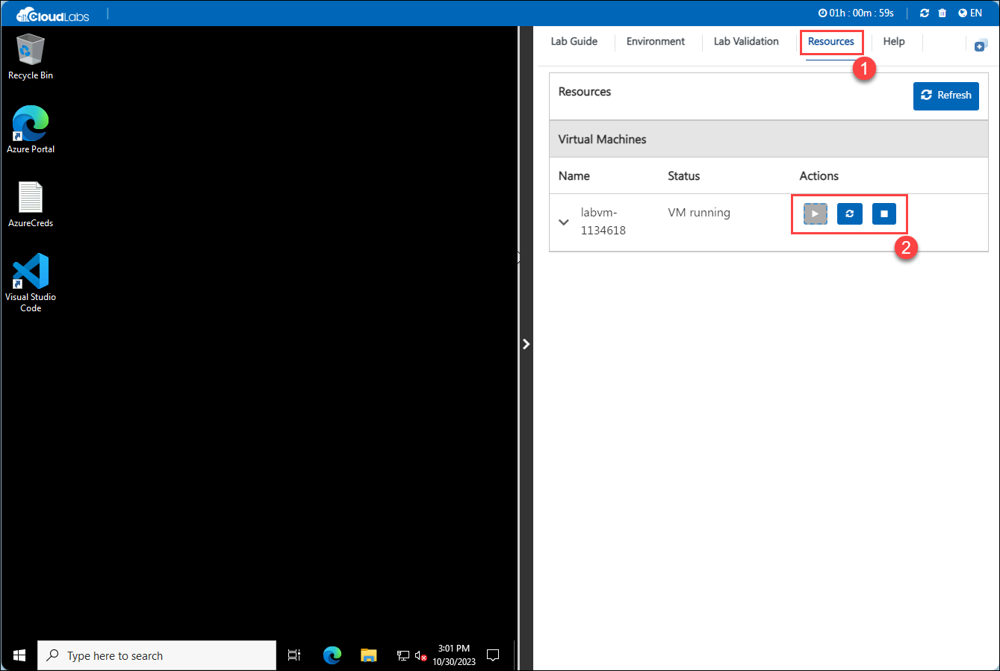

# Getting Started with Your PL-200 Power Platform Functional Consultant Workshop
 
Welcome to your PL-200 Power Platform Functional Consultant workshop! We've prepared a seamless environment that provides a hands-on platform with access to Power Platform tools, learning resources, practical exercises, and support for immersive learning. Let's begin by making the most of this experience:
 
## Accessing Your Lab Environment
 
Once you're ready to dive in, your virtual machine and lab guide will be right at your fingertips within your web browser.
 

### Virtual Machine & Lab Guide
 
Your virtual machine is your workhorse throughout the workshop. The lab guide is your roadmap to success.
 
## Exploring Your Lab Resources
 
To get a better understanding of your lab resources and credentials, navigate to the **Environment Details** tab.
 

## Utilizing the Split Window Feature
 
For convenience, you can open the lab guide in a separate window by selecting the **Split Window** button from the Top right corner.
 

 
## **Lab Duration Extension**

1. To extend the duration of the lab, kindly click the **Hourglass** icon in the top right corner of the lab environment. 

        

    >**Note:** You will get the **Hourglass** icon when 10 minutes are remaining in the lab.

3. Click **OK** to extend your lab duration.
 
        

4. If you have not extended the duration prior to when the lab is about to end, a pop-up will appear, giving you the option to extend. Click **OK** to proceed.

## Managing Your Virtual Machine
 
Feel free to start, stop, or restart your virtual machine as needed from the **Resources** tab. Your experience is in your hands!
 

 
Click "Next" from the bottom right corner to embark on your Lab journey!
 

 
Now you're all set to explore the powerful world of technology. Feel free to reach out if you have any questions along the way. Enjoy your workshop!
